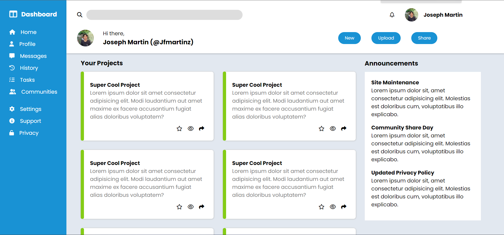
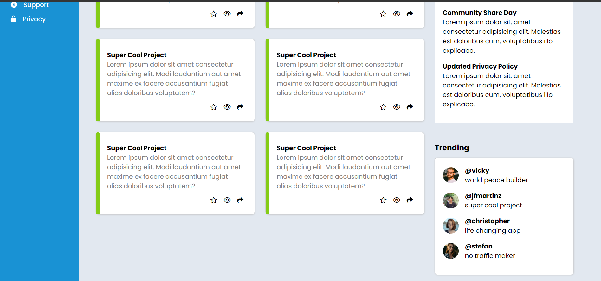

# Admin Dashboard
Admin dashboard using HTML and CSS. Grid and flex is used to laid out the layout. The website is not responsive, the main goal is to gain proficiency using grid and flex when layouting a website.

 

#### Connect with me 🤝

Twitter: [@jfmartinz](https://twitter.com/jfmartinz) 
LinkedIn: [@jfmartinz](https://www.linkedin.com/in/jfmartinz/) 
Github: [@jfmartinz](https://github.com/jfmartinz)